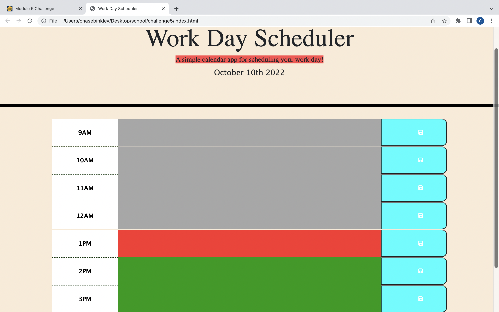
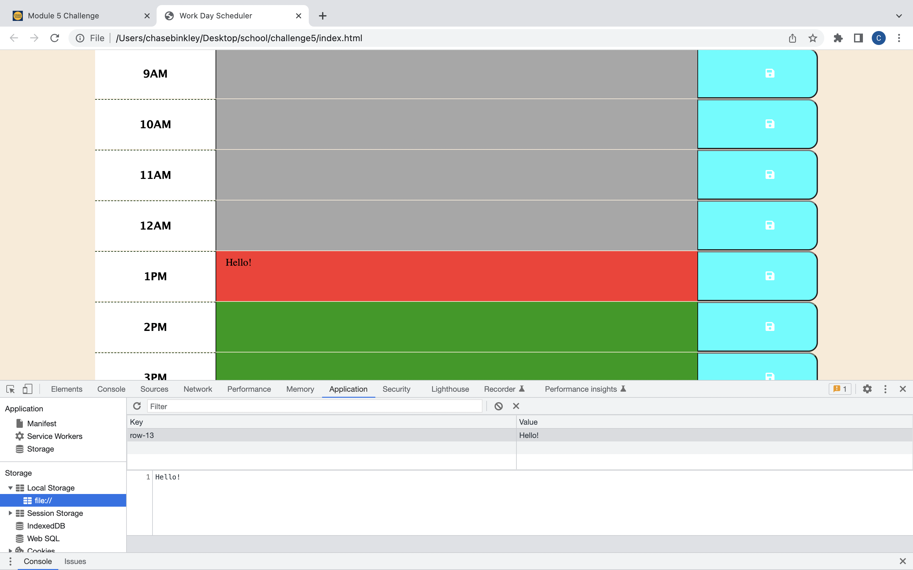

# Challenge5-calendar

## Description

I was given basic HTML and CSS code to create a calender application using jquery and moment APIs. The application allows the user to enter and save events for each hour of their work day using local storage. The hour time blocks are color-coded to indicate whether they are in the past, present, or future.

### Links

Deployed Site URL: []

#### Screenshot

